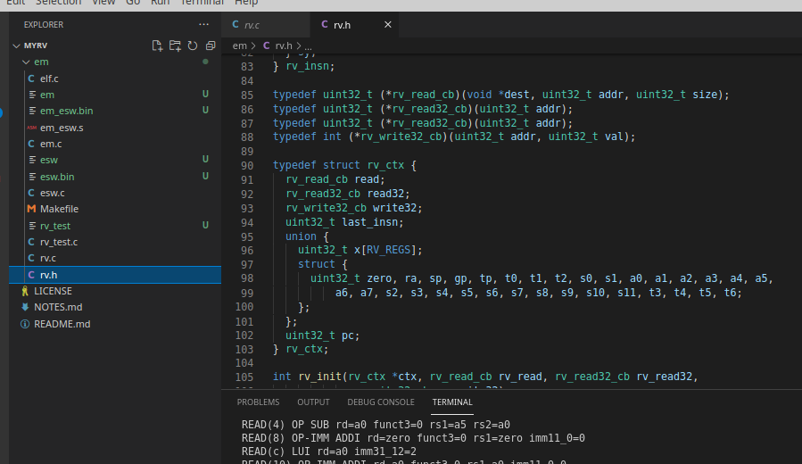

# myrv

## RISC-V experiments
Basically a simple RV32IM emulator written from scratch (along with small test ESWs), based on the following documentation:
- [RV specs PDF](https://github.com/riscv/riscv-isa-manual/releases/download/Ratified-IMAFDQC/riscv-spec-20191213.pdf)
- [RV32I cheat sheet](https://metalcode.eu/2019-12-06-rv32i.html)
- [RV home](https://riscv.org/technical/specifications/)

Uses instrumented RISCV32 QEMU+GDB combination, to check for 100% accuracy, without looking at qemu's riscv actual implementation..



## Prerequisites
In order to build native RISC-V esw, you must have a riscv toolchain available in your PATH:
- Clone https://github.com/riscv-software-src/riscv-gnu-toolchain
- Make sure autoconf, GNU awk, flex, bison and texinfo are installed, E.g.:
  - `$ sudo apt install gawk flex bison texinfo`
- `$ ./configure --prefix=$PWD/the_install --with-arch=rv32g --with-abi=ilp32d && make`

Also the emulator uses ELF files, so the libelf dev package must be available
- `sudo apt install libelf-dev`

Optionally, to use the qemu+gdb feature described below, the Qemu User RISCV tool must be installed
- `sudo apt install qemu-user`

## Test it!
```
$ cd em
$ make clean all test
rm -f *.o *.bin rv_test em em_esw esw elf qcheck
cc -Wall -Werror -g -O0 -o rv_test rv_test.c rv.c
cc -Wall -Werror -g -O0 -o em em.c rv.c -lelf
riscv32-unknown-elf-gcc esw.c -g -O0 -fsigned-char -Ttext=0 -o esw
riscv32-unknown-elf-as -o em_esw.o em_esw.s
riscv32-unknown-elf-gcc em_esw.o -o em_esw -nostartfiles
./em esw 
[Loaded ELF]
Hello riscv
[A0 reg at finish : -5 (should be -5)]
```
## Compare emulation with qemu+gdb
A nifty trick is used to compare 100% emulation accuracy with qemu-riscv32 at register-level.
The principle is to fork+execve in parallel an `qemu-riscv32` instance on the same esw waiting for gdb connection,
and then to fork+execve in parallel an `riscv32-unknown-elf-gdb` that connects to qemu.
Then our emulation single-steps the esw execution, comparing all registers with qemu's instance, reporting detailed diff.

Following example shows effect of `SW` emulation discrepancy between this impl and QEMU: the immediate offset sign was not correctly extended, leading to a register difference when `LW` loaded back with a correct immediate offset sign extension.
```
$ make clean all && ./em esw -q
 Program#0: 00000793
 Program#1: 00000000
[Loaded ELF]
{qpid is 41774}
{gpid is 41775}
{Done}
[qcheck #0]
...
[qcheck #142]
QEMU x14=fffffffe DIFFERENT from our x14=00000000!
               QEMU reg value                           Our reg value  
ra             0x194            404                     0x194           404     
sp             0x1ffff10        33554192                0x1ffff10       33554192
gp             0x1dc8           7624                    0x1dc8          7624    
tp             0x0              0                       0x0             0       
t0             0x2c4            708                     0x2c4           708     
t1             0xf              15                      0xf             15      
t2             0x0              0                       0x0             0       
s0             0x1ffff30        33554224                0x1ffff30       33554224
s1             0x0              0                       0x0             0       
a0             0xfffffffe       -2                      0xfffffffe      -2      
a1             0xfffffffd       -3                      0xfffffffd      -3      
a2             0x0              0                       0x0             0       
a3             0x0              0                       0x0             0       
a4             0xfffffffe       -2              ***     0x0             0       
a5             0x0              0                       0x0             0       
a6             0x0              0                       0x0             0       
a7             0x0              0                       0x0             0       
s2             0x0              0                       0x0             0       
s3             0x0              0                       0x0             0       
s4             0x0              0                       0x0             0       
s5             0x0              0                       0x0             0       
s6             0x0              0                       0x0             0       
s7             0x0              0                       0x0             0       
s8             0x0              0                       0x0             0       
s9             0x0              0                       0x0             0       
s10            0x0              0                       0x0             0       
s11            0x0              0                       0x0             0       
t3             0x0              0                       0x0             0       
t4             0x0              0                       0x0             0       
t5             0x0              0                       0x0             0       
t6             0x0              0                       0x0             0       
pc             0x160     
~"0x00000164\t33\t  return a + b;\n"
[qcheck #142 failed]
```
